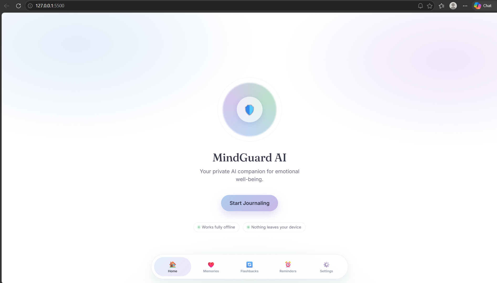
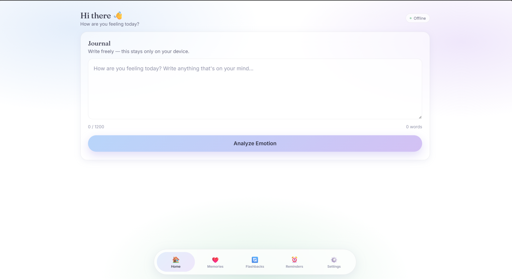
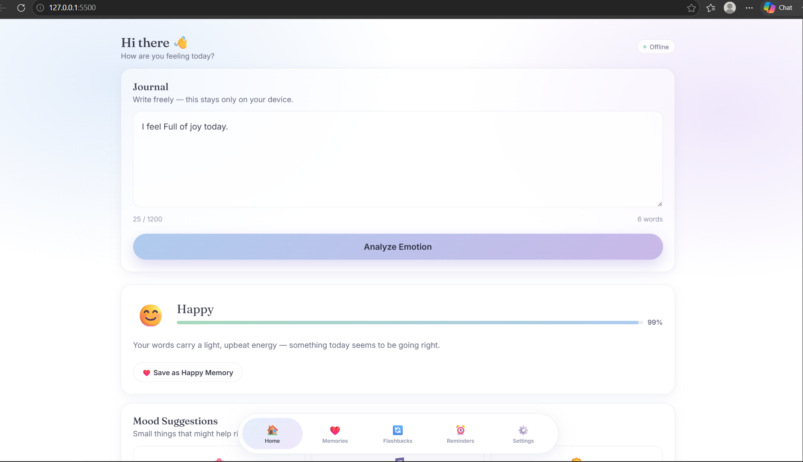
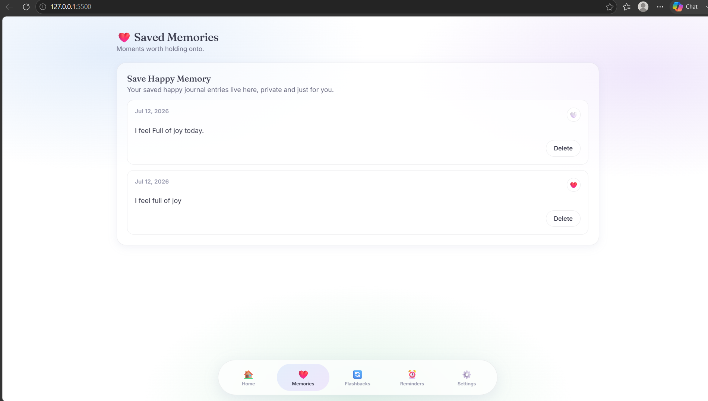
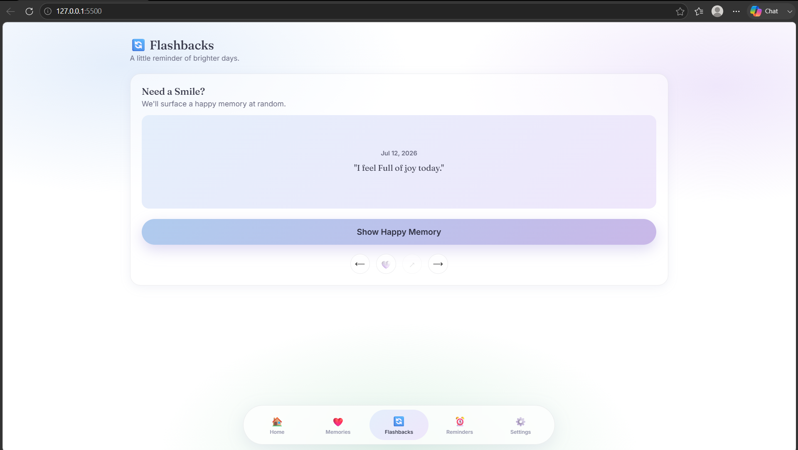
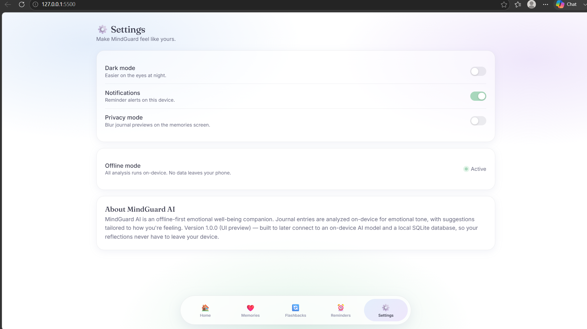

# 🧠 MindGuard AI

> An on-device AI powered mental wellness companion that analyzes emotions locally, protects user privacy, and helps users reflect through journaling, happy memories, and reminders.

<p align="center">
  
</p>

---

# 📖 Problem Statement

Many mental health applications rely on cloud-based AI services, requiring users to upload deeply personal journal entries and emotions to remote servers. This raises concerns about:

- Privacy
- Data security
- Internet dependency
- High inference costs
- Slow response times

Users deserve an AI companion that keeps their thoughts completely private.

---

# 💡 Solution

MindGuard AI is a browser-based mental wellness application that performs **emotion analysis entirely on the user's device** using Transformers.js.

No journal entries are sent to any external AI service.

The application helps users:

- Write personal journals
- Detect emotions locally
- Receive wellness suggestions
- Save positive memories
- Revisit happy moments
- Manage reminders
- Store everything securely using IndexedDB

---

# ✨ Features

## 🧠 On-Device Emotion Detection

- Emotion classification runs locally
- Powered by Transformers.js
- No cloud AI inference
- Fast and privacy-friendly

---

## 📔 Smart Journaling

Write daily journal entries and instantly understand your emotional state.

---

## ❤️ Happy Memories

Save meaningful moments and revisit them anytime.

---

## 🔄 Flashback Mode

Rediscover your happiest memories with a dedicated flashback experience.

---

## ⏰ Reminder Manager

Create personal reminders to stay productive and maintain healthy habits.

---

## 🌙 Dark Mode

Beautiful light and dark themes.

---

## 🔒 Privacy Mode

Hide sensitive journal content instantly.

---

## 💾 Offline Storage

All user data is stored locally using IndexedDB.

No external database is required.

---

# 🧠 On Device AI

MindGuard AI performs emotion classification **directly inside the browser**.

### AI Runtime

- Transformers.js

### Model

```
MicAb/emotion_text_classifier
```

### Runs On

- Browser
- Laptop
- Desktop

### Privacy

✅ No journal is uploaded.

✅ No cloud inference.

✅ AI executes completely on-device.

This fully aligns with the **OSDHack 2026 On Device AI theme.**

---

# 🛠 Tech Stack

## Frontend

- HTML5
- CSS3
- JavaScript (ES Modules)

## AI

- Transformers.js
- Hugging Face

## Storage

- IndexedDB

## Development

- VS Code
- Git
- GitHub

---

# 📂 Project Structure

```
MindGuardAI/

│
├── index.html
├── style.css
├── script.js
│
├── backend/
│   ├── backendManager.js
│   ├── indexedDB.js
│   ├── emotionClassifier.js
│   ├── emotionEnum.js
│   ├── emotionResult.js
│   ├── logger.js
│   ├── modelLoader.js
│   ├── notificationHelper.js
│   ├── suggestionManager.js
│   ├── utils.js
│   └── constants.js
│
├── LICENSE
└── README.md
```

---

# 🚀 Installation

Clone the repository

```bash
git clone https://github.com/lakshya-spec/MindguardAI.git
```

Open project

```bash
cd MindguardAI
```

Install dependencies

```bash
npm install
```

Start local server

```bash
npm run dev
```

or simply open using **Live Server**.

---

# 📱 How To Use

1. Open the application.
2. Write a journal.
3. Click **Analyze Emotion**.
4. View detected emotion.
5. Read AI wellness suggestions.
6. Save happy memories.
7. Create reminders.
8. Revisit memories using Flashback.

---

# 📸 Screenshots

## Home Page




## Journal



## Emotion Detection



## Memories



## Flashback



## Settings



# 🎥 Demo Video

[▶️ Watch Demo Video](https://github.com/lakshya-spec/MindgaurdAI/issues/1)

# 🔮 Future Scope

- Voice journal support
- Offline chatbot
- Mood analytics dashboard
- Weekly emotional insights
- AI habit recommendations
- Local speech emotion recognition

---

# 👥 Team

### Lakshya Srivastava

Frontend Developer

---

### Team Member 2

Backend Developer

---

### Team Member 3

Database Developer

---

# 🏆 OSDHack 2026

Built for **OSDHack 2026**

Theme:

> **On Device AI**

Our project demonstrates how modern AI can remain private by executing entirely on the user's device without sending sensitive data to external servers.

---

# 📄 License

This project is licensed under the **MIT License**.

See the **LICENSE** file for details.

---

# ❤️ Acknowledgements

- Open Source Developers Community (OSDC)
- Hugging Face
- Transformers.js
- Open Source Community